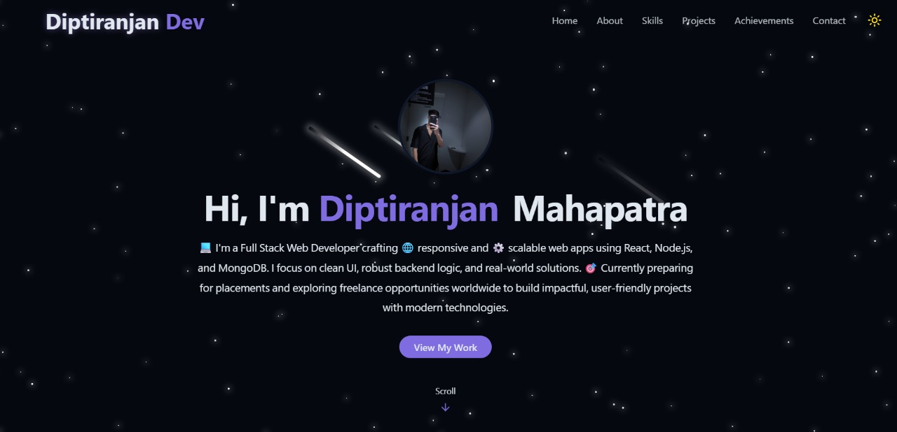

# 🌐 Diptiranjan Mahapatra — Full Stack Developer Portfolio

Welcome to my personal portfolio website! This project highlights my skills, completed projects, and professional experiences as a Full Stack Web Developer.

🔗 **Live Demo:** [View Live Site] ((https://diptranjan-jzmdwz2oz-diptiranjan-mahaptras-projects.vercel.app))
🛠️ **Technologies Used:** HTML, CSS, JavaScript, React, Tailwind CSS

## 📂 Project Structure

Diptiranjan-Dev/
├── node_modules/
├── public/
│   ├── pdfs/
│   ├── projects/
│   └── vite.svg
├── src/               # React components and source code
├── .eslintrc.cjs      # ESLint configuration
├── .gitignore         # Git ignore rules
├── banner.png         # Website banner/preview image
├── index.html         # Entry point HTML file
├── package.json       # Project metadata and dependencies
├── package-lock.json  # Exact dependency versions
└── vite.config.js     # Vite build configuration
## 📸 Preview

## 🚀 Features

* 🖥️ Clean, modern user interface with smooth animations
* 📱 Fully responsive layout for all devices
* 🌙 Optional dark mode support
* ⚙️ Interactive sections: Projects, About, Contact

## 📬 Get in Touch

* GitHub: [@Diptiranjan41](https://github.com/Diptiranjan41)
* LinkedIn: [Diptiranjan Mahapatra](https://www.linkedin.com/in/diptiranjan-mahapatra-25321a286)
* Email: [mahapatradiptiranjan064@gmail.com](mailto:mahapatradiptiranjan064@gmail.com)

## 📝 License

This project is licensed under the [MIT License](LICENSE).

If you would like, I can also provide:

* A detailed deployment guide for hosting on GitHub Pages using Vite
* Additional sections such as a professional bio or skills overview
* Enhanced README visuals with screenshots or badges

Feel free to ask!

